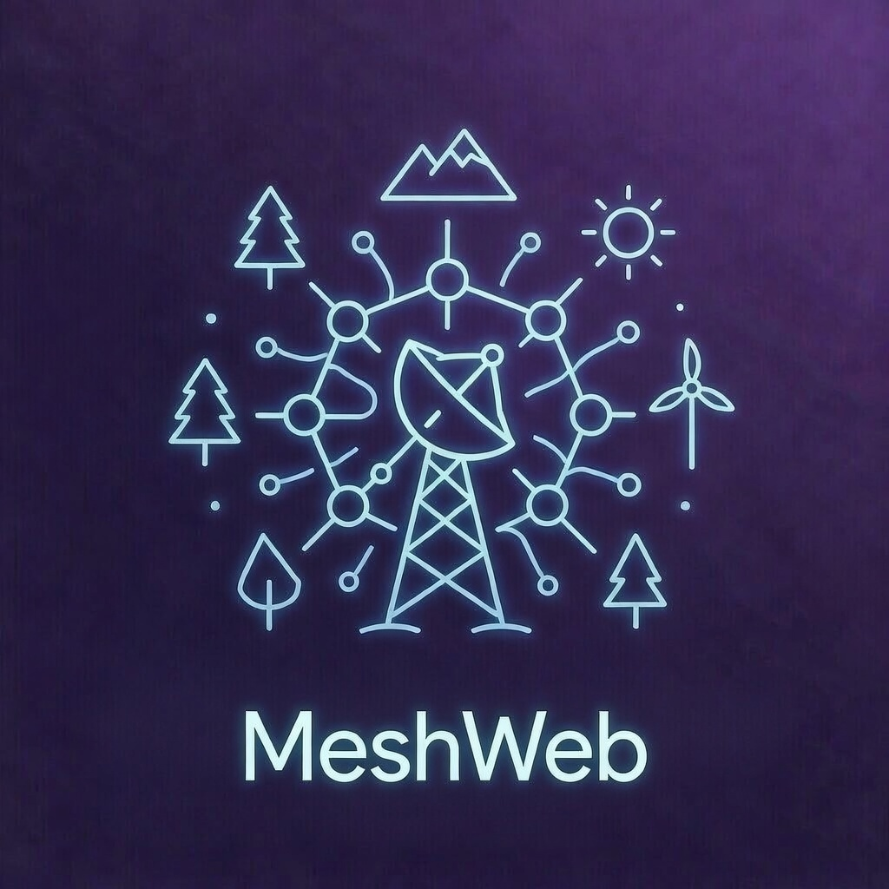
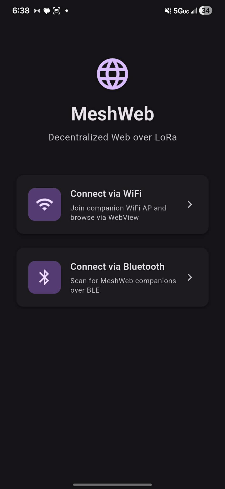
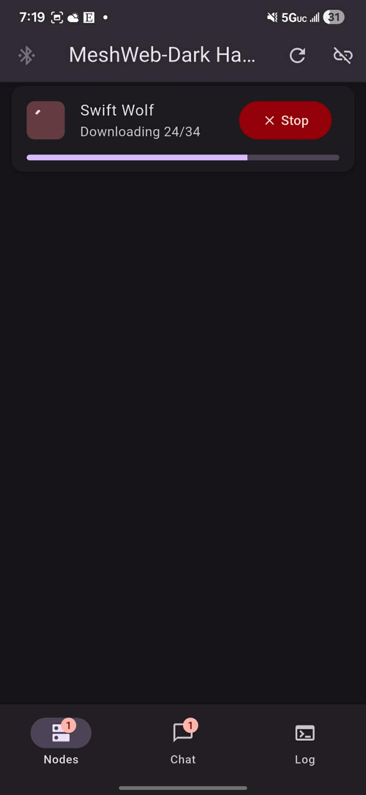
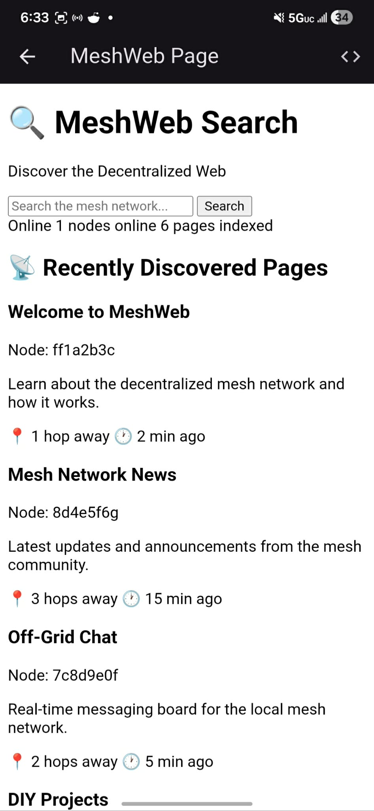
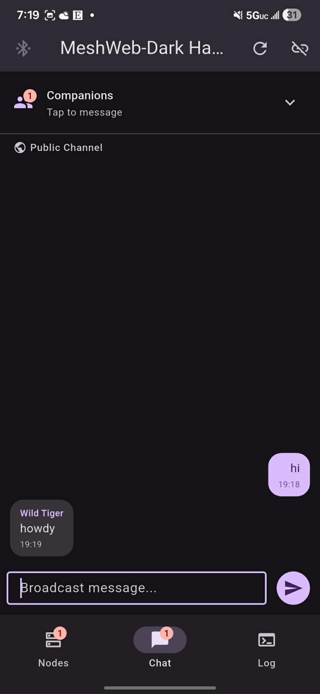
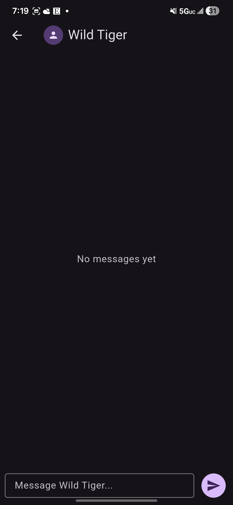
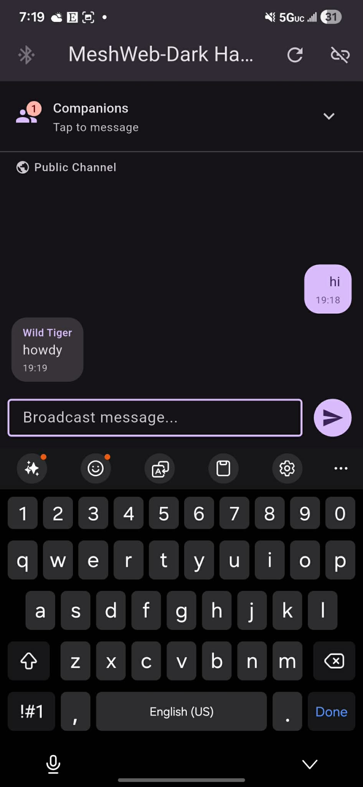

<p align="center">
  
</p>

# MeshWeb

**Decentralized Web Over LoRa** - A mesh network for hosting and browsing web pages without internet connectivity.

## Overview

MeshWeb enables decentralized web browsing over LoRa radio, allowing users to:
- **Host web pages** on nodes that broadcast their content over LoRa
- **Browse pages** using companion devices that request and display HTML
- **Discover nodes** automatically as they announce their hosted pages
- **Chat with other companions** on the mesh network

Perfect for off-grid communication, disaster scenarios, or building local community networks.

## Screenshots

<p align="center">
  
  
  
</p>
<p align="center">
  
  
  
</p>

*Top: Home screen, page download with progress & stop button, viewing a hosted page. Bottom: Public broadcast chat, DM with companion, chat input.*

## Architecture

```
┌─────────────────┐         LoRa          ┌─────────────────┐
│   Host Node     │◄──────────────────────►│   Companion     │
│  (Heltec V3)    │   PAGE_ANNOUNCE        │  (XIAO/Heltec)  │
│                 │   PAGE_REQUEST         │                 │
│  Serves HTML    │   PAGE_DATA            │  Browse pages   │
│  files over     │                        │  via WiFi AP    │
│  LoRa radio     │                        │                 │
└─────────────────┘                        └─────────────────┘
                                                   │
                                              WiFi │
                                                   ▼
                                           ┌──────────────┐
                                           │   Phone/     │
                                           │   Laptop     │
                                           │   Browser    │
                                           └──────────────┘
```

## Components

### `/host` - Host Node Firmware
ESP32 + LoRa device that:
- Hosts HTML/CSS/JS files on SPIFFS
- Broadcasts PAGE_ANNOUNCE every 60 seconds
- Responds to page requests with chunked data
- Provides web interface for file management (`/upload`)

**Supported boards:** Heltec WiFi LoRa 32 V3

### `/companion` - Companion Firmware  
ESP32 + LoRa device that:
- Discovers host nodes on the mesh
- Requests and displays web pages
- Connects to the Android app via BLE (Nordic UART Service)
- Creates WiFi AP for direct browser access
- Supports broadcast and direct companion-to-companion messaging

**Supported boards:** Seeed XIAO ESP32-S3 + Wio-SX1262, Heltec WiFi LoRa 32 V3

### `/android` - Android App
Flutter-based mobile app that connects to companions over BLE:
- Scan and connect to nearby MeshWeb companions
- Browse pages with download progress and cancel support
- Public broadcast chat channel
- Direct messaging between companions
- Also supports WiFi AP connection via WebView

### `/pi-host` - Pi Host Daemon
Flask-based web UI for USB-connected companions on Raspberry Pi or laptop.

## Quick Start

### 1. Flash a Host Node
```bash
cd host
pio run -e heltec-v3 -t upload
```

### 2. Flash a Companion
```bash
cd companion
# For XIAO ESP32-S3:
pio run -e xiao_esp32s3 -t upload

# For Heltec V3:
pio run -e heltec_v3 -t upload
```

### 3. Connect and Browse

**Via Android App (BLE):**
1. Install the MeshWeb APK on your Android device
2. Open the app and tap "Connect via Bluetooth"
3. Scan for and connect to your companion
4. Tap "Browse" on discovered nodes to view pages
5. Use the Chat tab for broadcast or direct messaging

**Via WiFi:**
1. Connect your phone/laptop to the companion's WiFi AP
   - SSID: `MeshWeb-Browser - <name>`
   - Password: `meshweb123`
2. Open browser to `http://192.168.4.1`
3. Click on discovered nodes to browse their pages

## WiFi Credentials

| Device | SSID Pattern | Password |
|--------|--------------|----------|
| Companion | `MeshWeb-Browser - <name>` | `meshweb123` |
| Host Node | `MeshCore-Web - <name>` | `meshcore123` |

## Protocol

MeshWeb uses a custom protocol over LoRa:

| Message Type | Code | Description |
|--------------|------|-------------|
| PAGE_ANNOUNCE | 0x01 | Host broadcasts available pages |
| PAGE_REQUEST | 0x02 | Companion requests a page |
| PAGE_DATA | 0x03 | Host sends page chunks |
| COMPANION_ANNOUNCE | 0x10 | Companion announces presence |
| COMPANION_MESSAGE | 0x11 | Chat between companions |

## Radio Settings

- **Frequency:** 915.0 MHz (US ISM band)
- **Bandwidth:** 250 kHz
- **Spreading Factor:** 9
- **Sync Word:** 0x12

## Creating Mesh Links

Link to pages on other nodes using the `mesh://` protocol:

```html
<a href="mesh://9e75cd90/index.html">Visit Node 9e75cd90</a>
```

The node ID is shown in the companion's web interface.

## Features

- ✅ Automatic node discovery
- ✅ BLE connectivity (Android app ↔ companion)
- ✅ Progress bar during page downloads with cancel support
- ✅ Inter-node linking with `mesh://` protocol
- ✅ File upload/delete on host nodes
- ✅ Broadcast and direct companion-to-companion chat
- ✅ Unread message badges
- ✅ Multiple companion support with request filtering

## License

MIT License - See [LICENSE](LICENSE) for details.

## Contributing

Contributions welcome! Please open an issue or PR.
